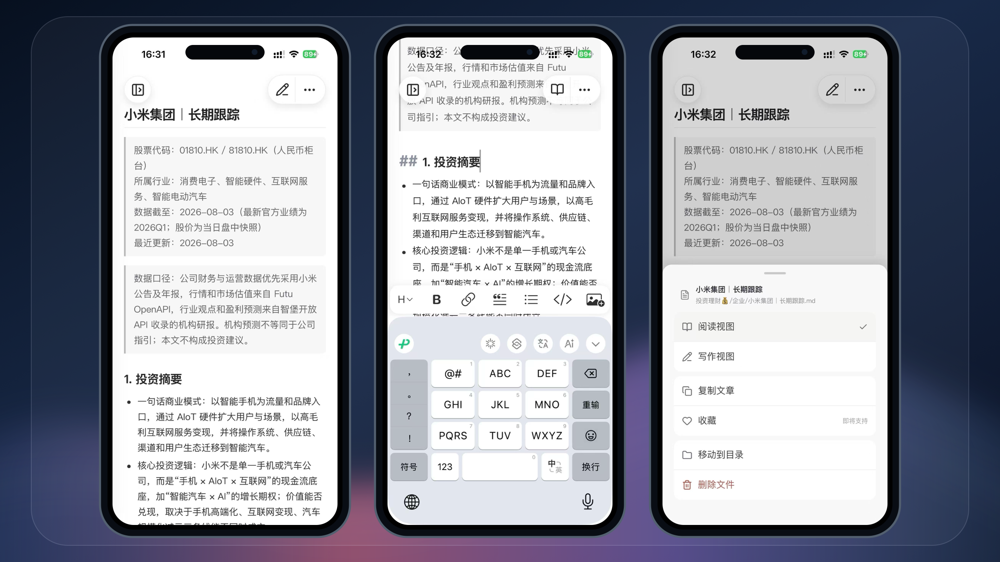
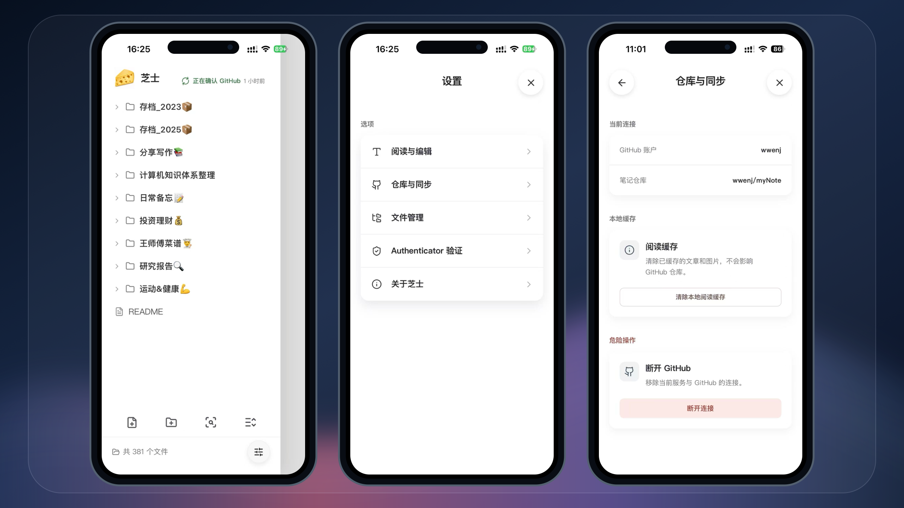

<p align="center">
  
</p>

<h1 align="center">芝士，就是力量！！</h1>
<p align="center">CheeseNotes（芝士笔记）自部署、无广告的 Markdown 笔记与 GitHub 双向同步的 Web + IOS APP 开源项目</p>

## 项目简介

CheeseNotes（芝士笔记）是一套以 iOS 使用体验为中心的个人笔记系统。它把 Markdown 文件保留在用户自己的 GitHub 仓库中，以自部署服务负责可靠读写和双向同步，让手机上的记录、阅读与整理不再受传统自部署笔记系统的网络延迟、文件分散和同步状态不透明所限制。

项目不内置广告，也不把笔记正文交给第三方 SaaS。Markdown 与附件始终是可直接访问、可迁移的文件；GitHub 仓库是可验证的远端副本。

## 主要特色

- **为 iOS 而生的笔记体验**：通过 Capacitor 打包为原生 iOS App，适配原生键盘、相机选图和安全存储；阅读、编辑、插图与文件管理集中在一个轻量工作台中。
- **快速打开，专注写作**：App 内置页面资源，并缓存最近访问的文章和资源，减少重复请求与等待；Markdown 编辑保留源码可见性，同时提供实时的阅读反馈。
- **Authenticator 验证，简单而安全**：首次输入 6 位 Authenticator 验证码即可在当前设备完成验证，设备凭据使用安全存储保存；服务端对受保护接口校验设备令牌，未验证设备不能读取或修改笔记。
- **Markdown 是唯一内容格式**：笔记直接以 `.md` 保存，支持常见 Markdown、GFM、内部链接与图片引用。不锁定私有文档格式，随时可以用 Git、GitHub 或其他 Markdown 工具继续使用。
- **GitHub 双向同步**：首次连接仓库后，服务端创建真实 Git working tree；本地保存、远端更新、提交、合并与推送都通过标准 Git 流程完成。
- **同步结果可验证**：服务端在 push 后再次读取远端 ref；只有远端提交确实与预期一致，才会显示“已同步”。发生并发修改时保留冲突信息和处理入口，不把未确认状态伪装成成功。
- **自部署但不牺牲可用性**：SQLite 只保存索引、同步状态、任务与必要凭据，笔记正文和附件保留在挂载的数据卷中的 Git 工作树；服务重启后仍可从 GitHub 恢复内容。

## iOS 操作一览

从主屏进入、启动并打开首页；随后阅读、写作与管理文章，最后浏览知识库、调整设置并管理仓库同步。以下三组展示图均由真实手机截图直接合成。

<p align="center">
  
</p>

<p align="center">
  
</p>

<p align="center">
  
</p>

## 设计概览

```text
iOS App
  │  阅读、编辑、图片与文件管理
  ▼
CheeseNotes 服务端（NestJS + Fastify）
  │  SQLite：状态、索引、同步任务与凭据
  ▼
持久卷中的 Git working tree
  │  fetch / commit / merge / push / 远端 ref 校验
  ▼
用户自己的 GitHub 仓库
```

## 本地运行

先复制服务端配置模板：

```bash
cp server/config/runtime.example.json server/config/runtime.local.json
```

编辑 `server/config/runtime.local.json`，只需替换 `development` 下的以下配置：

- `authenticatorSecret`：Authenticator 使用的 Base32 TOTP Secret，用于生成和校验设备登录验证码。请自行生成独立密钥，将密钥配置到当前配置，下载手机 Authenticator 应用，将密钥添加到 Authenticator App，每次重新登录需要在 Authenticator App 中获取临时验证码登录。
- `githubOAuth.clientId`：打开 https://github.com/settings/developers 新增 GitHub OAuth App ，填写 Client ID，并配置的到当前配置中。
- `githubOAuth.clientSecret`：同样在 GitHub OAuth App 中配置 Client Secret，用于服务端完成 GitHub 授权，不能提交到 Git 仓库或泄露给客户端。

需要生成本地、线上两个 OAuth App 对应两种 callback URL ，为 GitHub 授权后的回跳地址，本地环境设置为 `http://localhost:3000/api/auth/github/callback`，否则本地无法完成 GitHub 授权登录。

分别启动服务端和 Web：

```bash
cd server
pnpm install
pnpm start:dev
```

```bash
cd web
pnpm install
pnpm dev
```

浏览器访问 `http://localhost:5173`。开发服务器会把 `/api` 请求代理到 `http://localhost:3000`。

iOS 真机调试时，先复制配置模板：

```bash
cp config/.env.example config/.env.local
```

将 `config/.env.local` 中的 `NOTEAI_SERVICE_ORIGIN` 设置为线上服务地址，然后同步并打开 Xcode 工程：

```bash
cd ios-capacitor
pnpm install
pnpm ios:sync
pnpm ios:open
```

在 Xcode 中设置 Signing Team，选择已连接的 iPhone 后直接运行即可。

当前 iOS App 基于 Web 构建，`pnpm ios:sync` 会先完整构建 Web，再将产物打包进 iOS 工程；Web 代码修改后需要重新执行该命令。

## 私有化部署

填写 `server/config/runtime.local.json` 的 `production` 配置后，分别构建 Web 和服务端，再启动生产服务：

```bash
cd web
pnpm install
pnpm build

cd ../server
pnpm install
pnpm build
pnpm start
```

Web 构建产物会写入 `server/public`，由服务端统一托管。生产环境需要长期保持服务进程运行，并确保 `dataRoot` 指向的目录不会因发布或重启而丢失。线上建议通过 Nginx、Caddy 等反向代理提供 HTTPS，并将域名转发到服务端 `3000` 端口。

打包 iOS App 前，将 `config/.env.local` 中的 `NOTEAI_SERVICE_ORIGIN` 设置为线上 HTTPS 服务地址，然后构建并打开 Xcode 工程：

```bash
cd ios-capacitor
pnpm ios:sync:production
pnpm ios:open
```

在 Xcode 中设置 Bundle Identifier、版本号和 Signing Team，选择 `Any iOS Device (arm64)`，再通过 `Product > Archive` 构建归档。归档完成后在 Organizer 中选择 `Distribute App > App Store Connect > Upload` 上传，最后到 App Store Connect 创建版本、填写应用信息并提交审核。发布到 App Store 或通过 TestFlight 分发需要加入付费的 Apple Developer Program。
