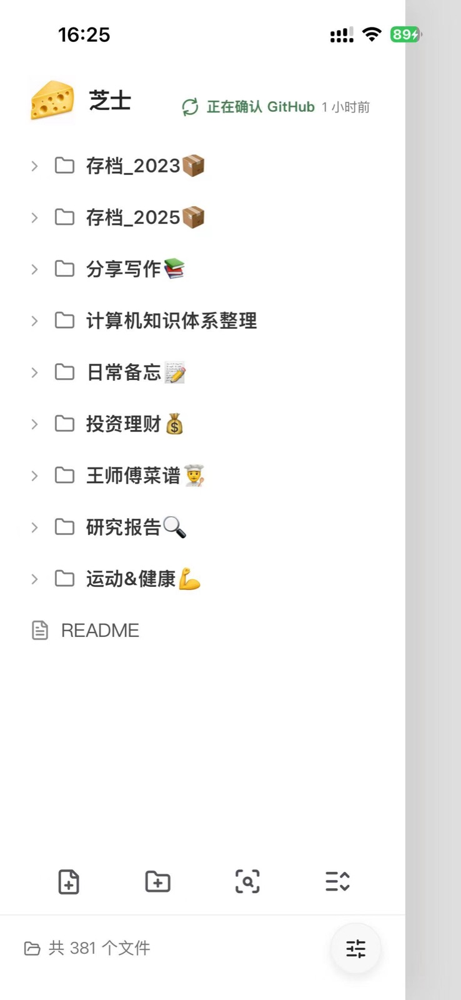
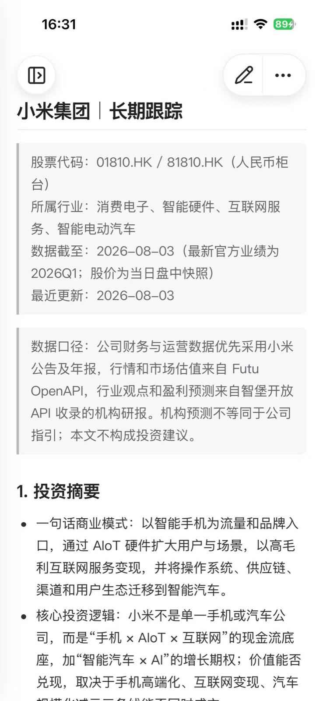
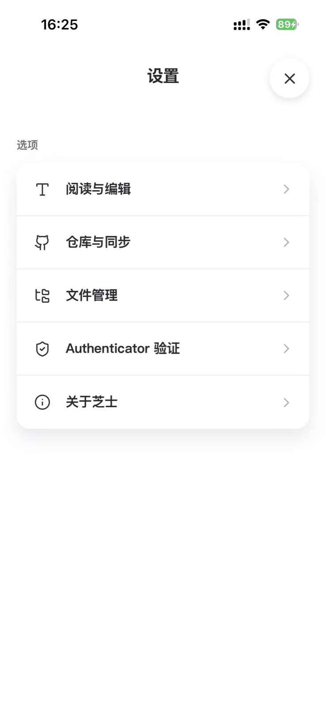
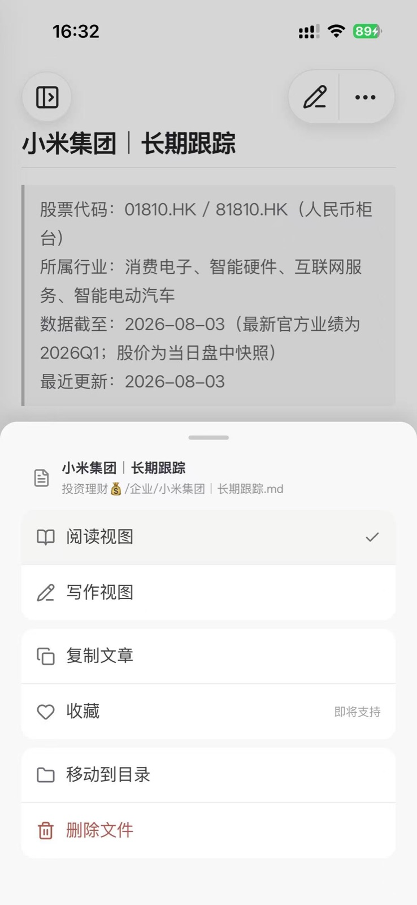
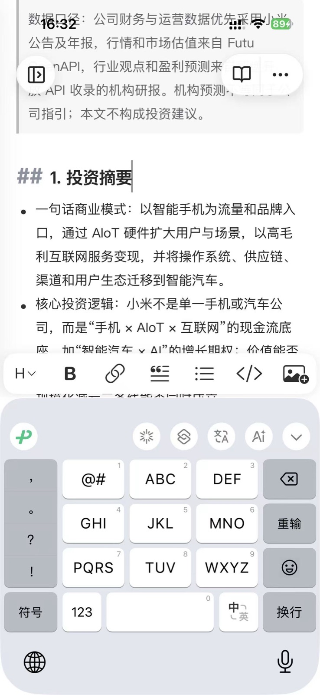

<p align="center">
  
</p>

<h1 align="center">CheeseNotes</h1>
<p align="center">CheeseNotes（芝士笔记）自部署、无广告的 Markdown 笔记与 GitHub 双向同步的 Web + IOS APP 开源项目</p>

## 项目简介

CheeseNotes（芝士笔记）是一套以 iOS 使用体验为中心的个人笔记系统。它把 Markdown 文件保留在用户自己的 GitHub 仓库中，以自部署服务负责可靠读写和双向同步，让手机上的记录、阅读与整理不再受传统自部署笔记系统的网络延迟、文件分散和同步状态不透明所限制。

项目不内置广告，也不把笔记正文交给第三方 SaaS。Markdown 与附件始终是可直接访问、可迁移的文件；GitHub 仓库是可验证的远端副本。

## 主要特色

- **为 iOS 而生的笔记体验**：通过 Capacitor 打包为原生 iOS App，适配原生键盘、相机选图和安全存储；阅读、编辑、插图与文件管理集中在一个轻量工作台中。
- **快速打开，专注写作**：App 内置页面资源，并缓存最近访问的文章和资源，减少重复请求与等待；Markdown 编辑保留源码可见性，同时提供实时的阅读反馈。
- **Authenticator 验证，简单而安全**：首次输入 6 位 Authenticator 验证码即可在当前设备完成验证，设备凭据使用安全存储保存；服务端对受保护接口校验设备令牌，未验证设备不能读取或修改笔记。
- **Markdown 是唯一内容格式**：笔记直接以 `.md` 保存，支持常见 Markdown、GFM、内部链接与图片引用。不锁定私有文档格式，随时可以用 Git、GitHub 或其他 Markdown 工具继续使用。
- **GitHub 双向同步**：首次连接仓库后，服务端创建真实 Git working tree；本地保存、远端更新、提交、合并与推送都通过标准 Git 流程完成。
- **同步结果可验证**：服务端在 push 后再次读取远端 ref；只有远端提交确实与预期一致，才会显示“已同步”。发生并发修改时保留冲突信息和处理入口，不把未确认状态伪装成成功。
- **自部署但不牺牲可用性**：SQLite 只保存索引、同步状态、任务与必要凭据，笔记正文和附件保留在挂载的数据卷中的 Git 工作树；服务重启后仍可从 GitHub 恢复内容。

## iOS 操作一览

从启动页进入已连接的知识库。目录页展示 GitHub 确认状态；文章可在阅读与写作视图间切换，文件和同步设置集中管理。

<table>
  <tr>
    <td width="50%" align="center"><br /><sub>启动页</sub></td>
    <td width="50%" align="center"><br /><sub>知识库目录与同步状态</sub></td>
  </tr>
  <tr>
    <td width="50%" align="center"><br /><sub>Markdown 阅读视图</sub></td>
    <td width="50%" align="center"><br /><sub>仓库、同步与 Authenticator 设置</sub></td>
  </tr>
  <tr>
    <td width="50%" align="center"><br /><sub>阅读、写作与文件操作</sub></td>
    <td width="50%" align="center"><br /><sub>原生键盘下的 Markdown 写作</sub></td>
  </tr>
</table>

## 设计概览

```text
iOS App
  │  阅读、编辑、图片与文件管理
  ▼
CheeseNotes 服务端（NestJS + Fastify）
  │  SQLite：状态、索引、同步任务与凭据
  ▼
持久卷中的 Git working tree
  │  fetch / commit / merge / push / 远端 ref 校验
  ▼
用户自己的 GitHub 仓库
```

## 运行方式

服务端需要 Node.js 与 pnpm。GitHub OAuth 凭据放在 `server/config/github-oauth.local.json`，服务端与 iOS 的地址配置放在 `config/.env.local`；两者均被 Git 忽略。分别从相邻的 `.example` 文件复制后填写，客户端不会接触 Client Secret。

```bash
cd server
pnpm install
npm run start:dev
```

生产镜像可在仓库根目录构建。运行时请将持久卷挂载到 `/var/lib/note-service`，其中包含 SQLite 元数据、真实 Git 工作树及同步任务的恢复文件。

```bash
docker build -f server/Dockerfile -t cheesenotes .
```

## iOS 开发

```bash
cd ios-capacitor
pnpm install
pnpm ios:sync
```

`pnpm ios:sync:production` 会将生产服务地址写入独立的 iOS 打包副本，随后可在 Xcode 中打开 `ios/App/App.xcworkspace` 运行。
